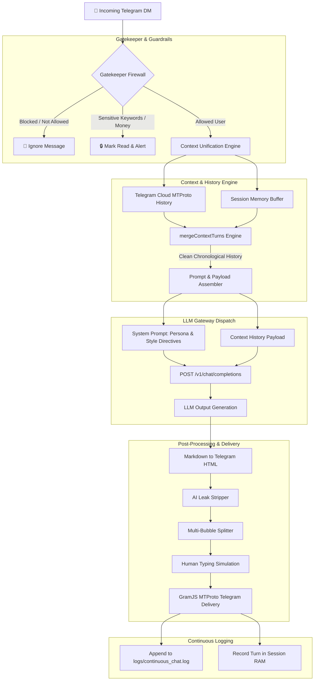

# Telegram Personal Auto-Messenger (SOTA MTProto Agent)

An intelligent, state-of-the-art auto-reply engine for 1:1 private messages on your personal Telegram account using any OpenAI-compatible LLM endpoint.

Operates **100% locally** via Telegram MTProto (GramJS) — **NO Telegram Bot API, NO Webhooks, NO Port Forwarding**.

---

## 🌟 Key Features

- **MTProto Userbot Engine**: Connects directly as your personal Telegram account using your String Session.
- **Unified Conversation Context**: Dynamically merges Telegram Cloud history with in-memory session streams to provide up to 8–15 chronological conversation turns to the LLM.
- **SOTA Agent Architecture**: Zero hardcoded mock responses, zero RAG fact pollution, zero keyword overrides. Pure, dynamic LLM output generation.
- **Telegram Rich-Text HTML Delivery**: Automatically converts markdown to native Telegram HTML tags (`<b>`, `<a>`, `<code>`, `<pre>`).
- **Human Typing Simulation**: Simulates human typing speeds and delay calculation before delivering message bursts.
- **Multi-Bubble Parser**: Intelligent message splitter for long responses.
- **Security & High-Stakes Guardrails**: Built-in allowlist, blocklist, and sensitive keyword firewall (`cbe`, `telebirr`, `password`, `private_key`).
- **Continuous Logging**: Appends all incoming and outgoing turns to `logs/continuous_chat.log` without data loss on restarts.

---

## 🏛️ System Architecture



---

## 📋 Prerequisites

1. **Node.js** (v18 or higher recommended)
2. **Telegram API ID & API Hash**: Get them from [my.telegram.org](https://my.telegram.org).
3. **OpenAI-Compatible LLM Gateway**: Any local or cloud endpoint (vLLM, LM Studio, Open-WebUI, Ollama, OpenRouter, OpenAI).

---

## 🚀 Quick Start

### 1. Clone & Install Dependencies

```bash
git clone https://github.com/bilalshemsu1/TG-Echo.git
cd TG-Echo
npm install
```

### 2. Configure Environment

Copy `.env.example` to `.env`:

```bash
cp .env.example .env
```

Configure `.env`:

```env
# Telegram Credentials from https://my.telegram.org
TG_API_ID=your_api_id_here
TG_API_HASH=your_api_hash_here

# Leave empty initially. Generated on first login to save here:
TG_SESSION=

# Telegram Cloud History Retrieval
FETCH_TELEGRAM_HISTORY=true
HISTORY_LIMIT=8

# LLM Gateway Configuration
LLM_API_URL=http://localhost:3001/v1/chat/completions
LLM_API_KEY=your_llm_api_key_here
LLM_MODEL=openai/gpt-oss-20b

# Safety & Typing Timings
COOLDOWN_SECONDS=10
TYPING_SPEED_MS=45
MIN_TYPING_DELAY_MS=800
MAX_TYPING_DELAY_MS=2500
```

---

## 🏃 Running the Application

Start the auto-messenger listener:

```bash
npm start
```

On first run, GramJS will prompt for your phone number and 2FA login code, then output your `TG_SESSION` string to save in `.env`.

---

## 🧪 Running Integration Tests

Run the built-in test suite:

```bash
npm test
```

---

## 📜 License

[MIT](LICENSE)
